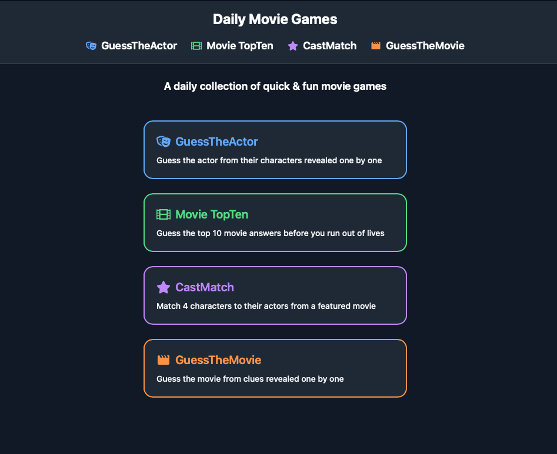
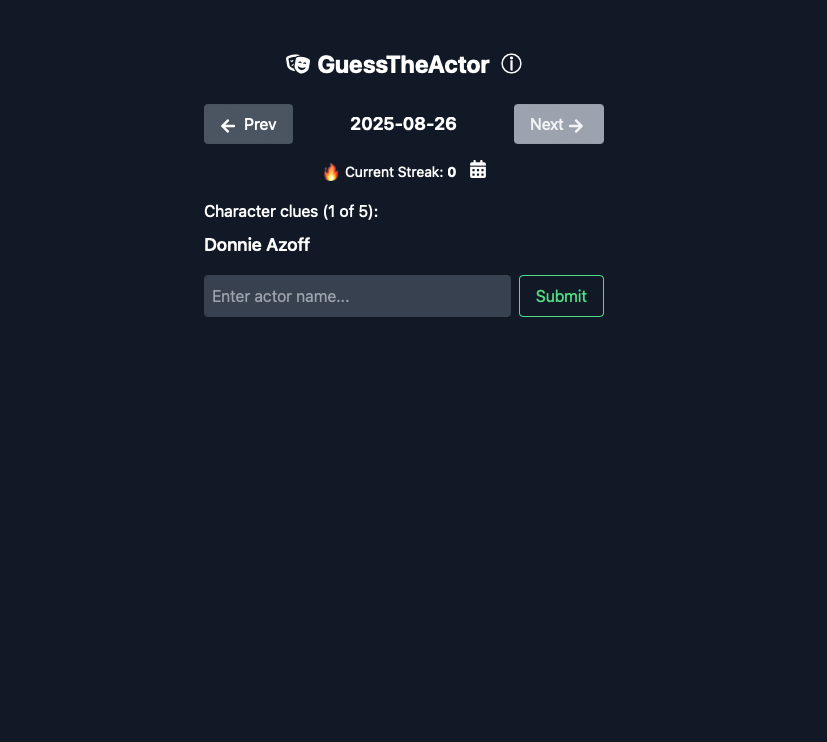
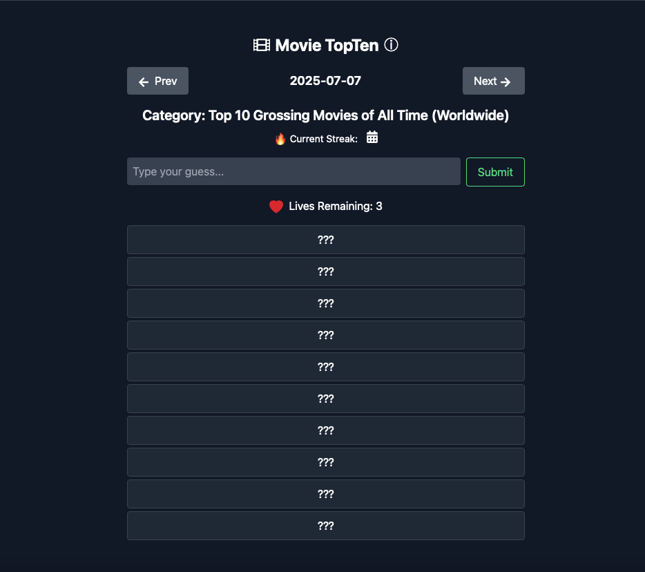
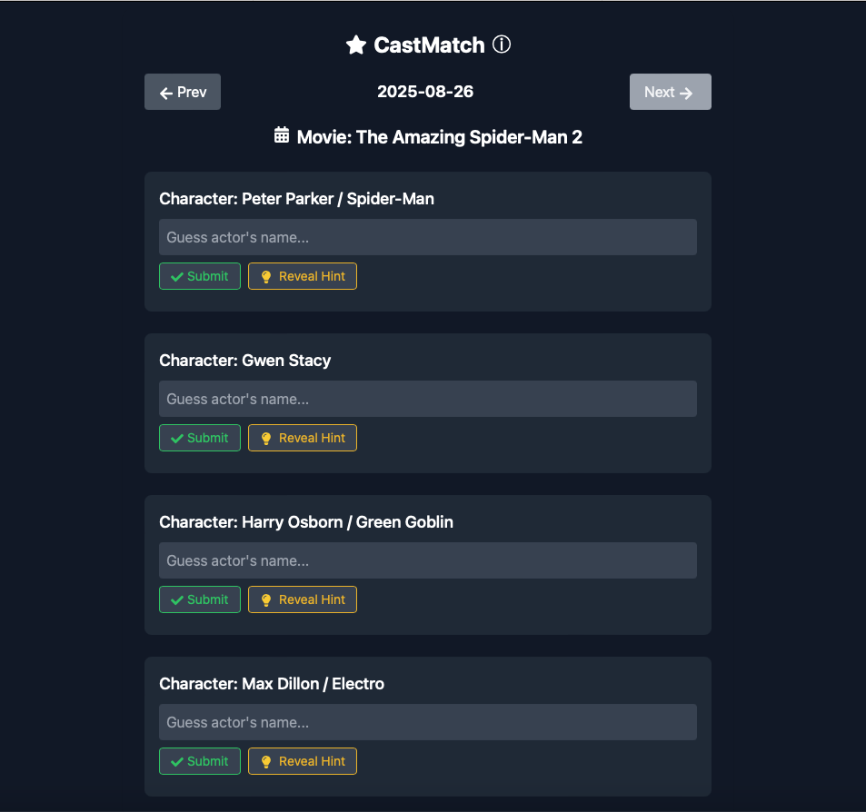
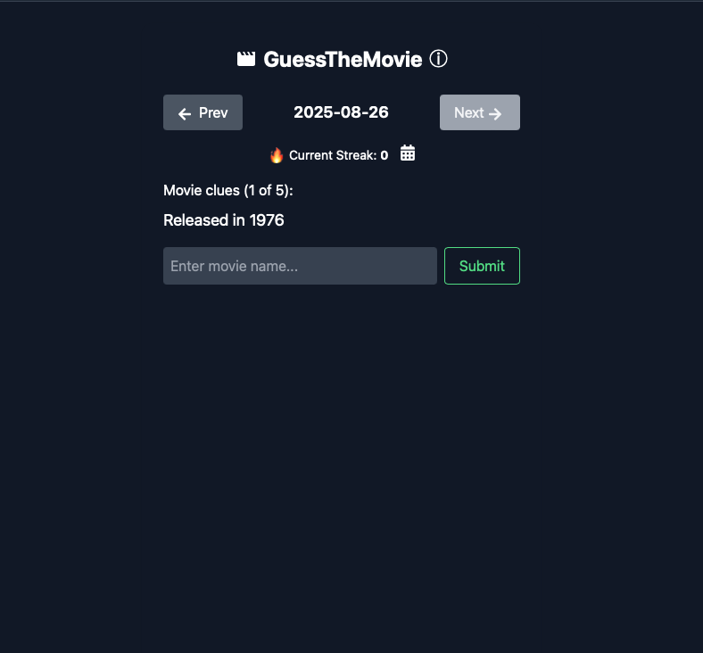

# 🎬 Daily Movie Games

A daily movie games website offering **4 original games** that update automatically every day.  
The site combines movie trivia, puzzles, and interactive challenges designed for film lovers.  

🌐 **Live Website:** [https://www.dailymovie.games](https://www.dailymovie.games)  

---

## 🎮 Games
- **Game 1: GuessTheActor** – Guess the actor from their characters revealed one by one.
- **Game 2: MovieTopTen** – Guess the top 10 movie answers before you run out of lives.  
- **Game 3: CastMatch** – Match 4 characters to their actors from a featured movie. 
- **Game 4: GuessTheMovie** – Guess the movie from clues revealed one by one 

---

## 🔧 Tech Stack
- **Frontend:** React, Tailwind CSS
- **Database:** Manually curated puzzles updated daily  
- **Deployment:** Vercel

---

## 📊 Features
- New puzzles and challenges every day.   
- Lightweight and mobile-friendly UI.
- Autocomplete and smart inputs for smoother guessing
- Share results features to compare results with friends

---

## 📸 Screenshots
  
  
  
  
  

---

## 🗂 Repo Structure  
This public repository is designed as a **project showcase**. It contains:  
- Documentation and technical write-ups  
- Screenshots of gameplay  

👉 **Note:** Core source code is private to protect intellectual property.  

---

## 📫 Contact
Created by **Jason Redding**  
- Email: Jasonredding883@gmail.com  
